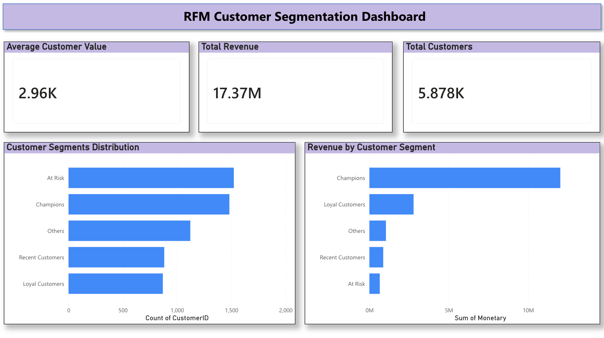

# RFM Customer Segmentation Dashboard
*(La version française suit)*

## Project Overview
This project analyzes customer purchasing behavior using RFM (Recency, Frequency, Monetary) segmentation to identify high-value customers and support business decision-making.

## Objectives
- Segment customers based on their purchasing behavior
- Identify high-value and at-risk customers
- Provide actionable business insights

## Tools & Technologies
- Python (Pandas)
- Power BI
- Data Cleaning & Transformation
- Data Visualization

## Key Features
- Customer segmentation using RFM analysis
- Interactive Power BI dashboard
- Business insights and recommendations

## Key Insights
- Champions generate the highest revenue and represent the most valuable customers
- At Risk customers represent a large portion but contribute less to revenue
- Loyal customers show strong engagement and upselling potential

## Dashboard Preview

### Page 1

## Business Recommendations
- Retain Champions with loyalty programs
- Re-engage At Risk customers with targeted campaigns
- Upsell Loyal customers
- Convert Recent customers into repeat buyers

## Project Structure
- Data cleaning and preprocessing
- RFM feature engineering
- Dashboard creation
- Business insights and storytelling

# Tableau de segmentation client RFM

## Aperçu du projet
Ce projet analyse le comportement d'achat des clients à l'aide de la segmentation RFM (Récence, Fréquence, Montant) afin d’identifier les clients à forte valeur et d’aider à la prise de décision.

## Objectifs
- Segmenter les clients selon leur comportement
- Identifier les clients à forte valeur et à risque
- Fournir des recommandations business

## Outils utilisés
- Python (Pandas)
- Power BI
- Nettoyage et transformation des données
- Visualisation de données

## Fonctionnalités
- Segmentation client avec RFM
- Dashboard interactif Power BI
- Insights et recommandations

## Insights clés
- Les Champions génèrent le plus de revenus
- Les clients à risque représentent une grande part mais faible valeur
- Les clients fidèles ont un fort potentiel

## Aperçu du Tableau de Bord

### Page 1

## Recommandations
- Fidéliser les Champions
- Réactiver les clients à risque
- Développer les clients fidèles
- Convertir les clients récents

## Structure du projet
- Nettoyage des données
- Création des variables RFM
- Dashboard
- Analyse et recommandations
